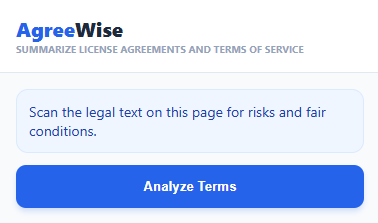
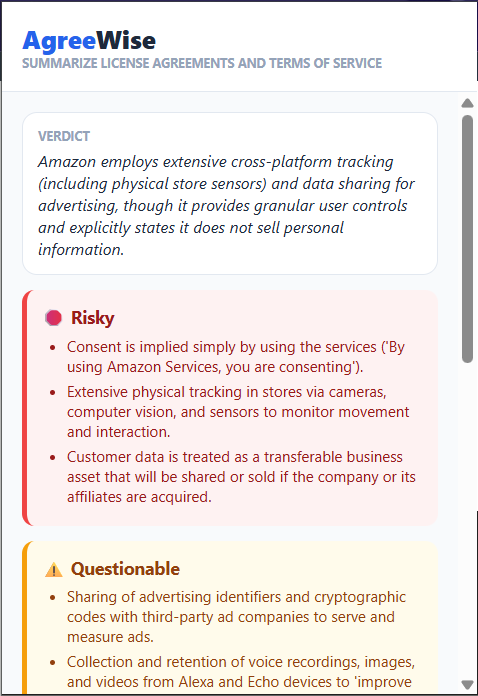
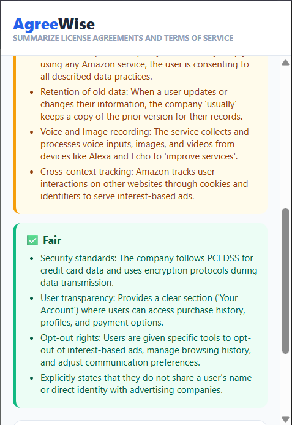
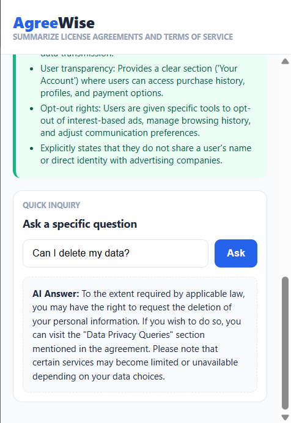

# AgreeWise 🎯

## Basic Details
**Team Name:** DeCode

**Team Members**
* **Member 1:** Divya Robin - RIT Kottayam
* **Member 2:** Gaurinandana S - RIT Kottayam

**Hosted Project Link**
(https://github.com/DivRob/AgreeWise.git)

## Project Description
AgreeWise is a Chrome extension intended to clarify complicated legal language present in Terms of Service and License Agreements. Utilizing AI, it quickly analyzes legal documents to deliver users a straightforward, understandable summary of their actual agreement.

## The Problem Statement
> Most internet users "Accept" terms and conditions without reading them because they are intentionally long, dense, and filled with legalese. This leads to users unknowingly consenting to invasive data collection, hidden fees, or waiving their legal rights.

## The Solution
AgreeWise solves this by extracting the text from any active webpage and passing it to the Gemini AI model. The extension categorizes clauses into Red, Yellow, and Green flags, allowing users to make an informed decision in seconds rather than hours.

---

## Technical Details

### Technologies/Components Used
**For Software:**
* **Languages used:** JavaScript, HTML, CSS
* **Frameworks used:** Chrome Extension Manifest V3
* **Libraries used:** Google Gemini API (Generative AI)
* **Tools used:** VS Code, Git

### Features
* **One-Click Analysis:** Instantly scrapes and analyzes the active tab's text.
* **Risk Categorization:** Uses a color-coded system (Red/Yellow/Green) to highlight risky vs. fair clauses.
* **AI-Powered Summarization:** Provides a 1-sentence "Verdict" for rapid assessment.
* **Smart Search Box:** Allows users to filter through the summary for specific terms like "data," "billing," or "termination."
* **Contextual UI:** Features a sleek, modern popup with interactive loading states.

---

## Implementation

### Installation
1. Clone the repository:
```bash
git clone https://github.com/DivRob/AgreeWise.git
```
2. Navigate to chrome://extensions/ in your browser.
3. Enable Developer Mode in the top right.
4. Click Load Unpacked and select the project folder.


### Run
1. Navigate to any website's "Terms of Service" or "Privacy Policy" page.
2. Click the AgreeWise icon in your extension toolbar.
3. Click Analyze Terms.
4. Use the Search Bar to filter results instantly.

---

## Project Documentation


### Screenshots



*Initial setup view prompting the user to analyze terms.*

 


*The results view displaying the AI-generated verdict and color-coded flags.*



*Smart Inquiry Feature: Users can ask specific questions to get instant, AI-simplified answers from the legal text.*

### Diagram

**System Architecture:**
* The extension follows the Manifest V3 architecture. The Popup (UI) communicates with the Content Script (Scraper) via message passing ([`chrome.tabs.sendMessage`](https://developer.chrome.com/docs/extensions/reference/api/tabs#method-sendMessage)). Once the text is retrieved, the Popup makes a direct REST API call to the Gemini 3 Flash model using a secure API key stored in `config.js`.

**Application Workflow**


---

### API Documentation

* **Base URL:** [`https://generativelanguage.googleapis.com`](https://ai.google.dev/api/rest)
* **Endpoint:** [`POST /v1beta/models/gemini-1.5-flash:generateContent`](https://ai.google.dev/api/rest/v1beta/models/generateContent)

#### Request Body:

```bash
{
  "contents": [{ "parts": [{ "text": "Prompt + Legal Text" }] }]
}
```
#### Response:

```bash
{
  "verdict": "High risk detected regarding data sharing.",
  "red": ["Shares data with 3rd parties"],
  "yellow": ["Automatic renewals"],
  "green": ["Clear deletion policy"]
}
```
---
## Demo Video
* Download demo video here:

---

## AI Tools Used

* **Tool Used:** Gemini / ChatGPT
* **Purpose:** Debugging async message passing and optimizing CSS for the flag containers.
* **Percentage of AI-generated code:** ~30%
* **Human Contributions:** Architecture design, UI/UX design decisions, and prompt engineering.

---

## Team Contributions
* Divya Robin: Lead Backend & API Integration. Implemented the Gemini fetch logic.
* Gaurinandana S: Frontend Design. Developed the CSS Root styles and UI layout.
